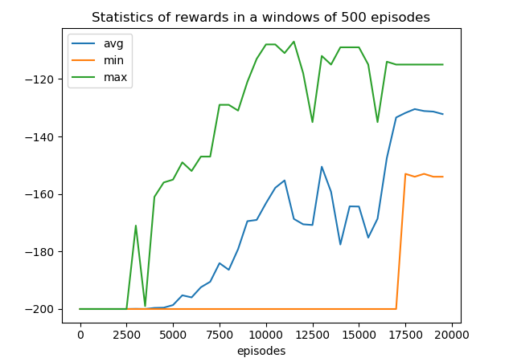
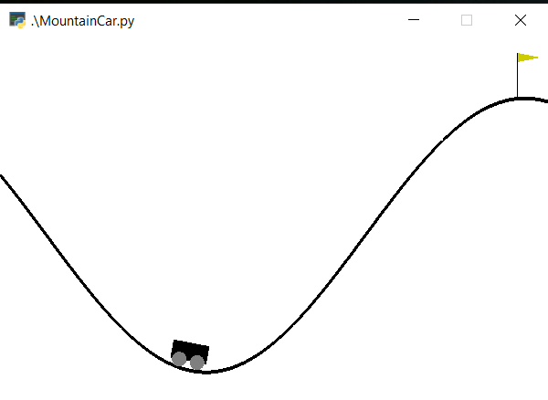

# Reinforcement-Learning
Implementations of various reinforcement learning algorithms

## k-armed Gaussian Bandits
`bandits.ipynb` Optimizing action selection on k-armed gaussian bandits using the Epsilon-Greedy and UCB algorithms. I have compared these algorithms using a 10-armed gaussian testbed of 2000 bandits, over 1000 steps. Theory available in Chapter 2 of 'Reinforcement Learning: An Introduction' by Sutton & Barto.

## MountainCar Q-Learning
`MountainCar.py` Trained an action-value table for the `MountainCar-v0` environment in the openAI gym, using Q Learning.  

